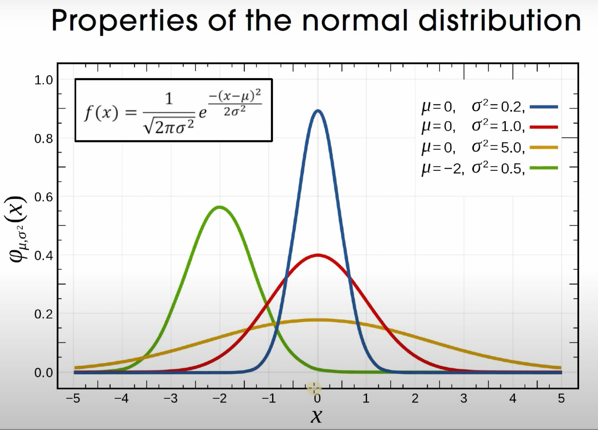
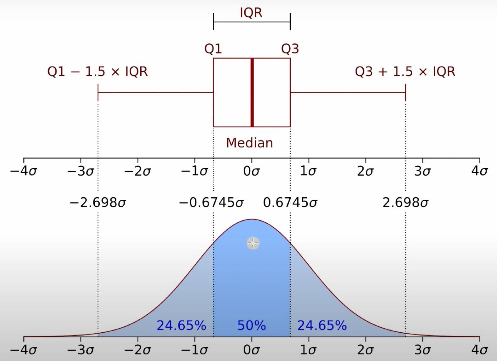
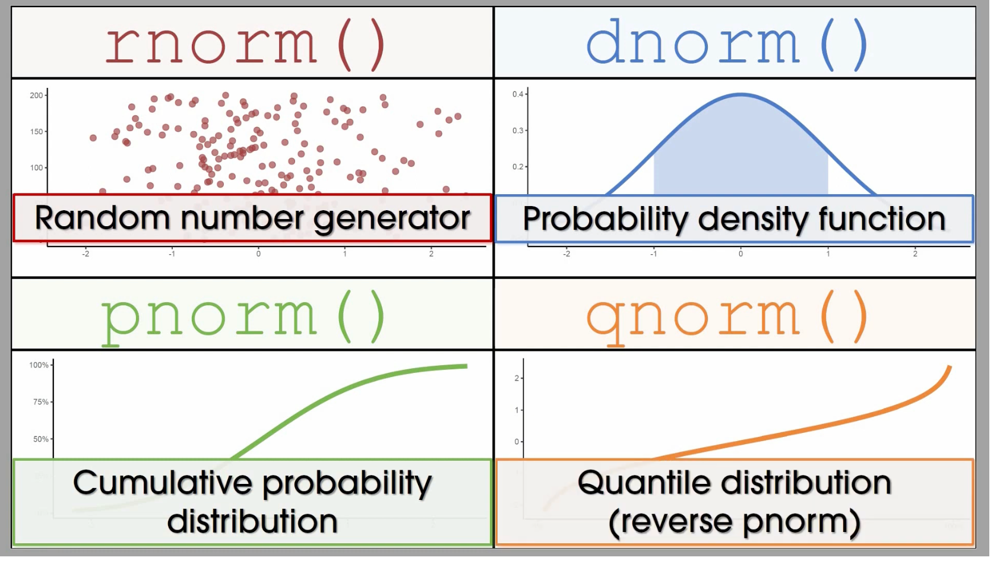

# Documentación

## Variables

-   Declaración de variables

```{r}
variable <- 123.4
a=0; b=1; c=3e9; d=exp(0) #(;)Forza salto de línea
```

-   Borrar variables

```{r}
rm(a,b)
rm (list=ls()) #Borrar todas
```

## Tipos de datos

```{r}
numeric <- 1.2
class (numeric)

character <- "Hola"
class (character)

interger <- as.integer(1)
class(interger)

logical <- FALSE
class (logical)

complex <- 1+1i
class(complex)

vector <- c("categ1", "categ2","categ2","categ3","categ5","categ3",
       "categ1", "categ1","categ5","categ1","categ4","categ1",
       "categ1", "categ5","categ2","categ2","categ1","categ1",
       "categ1", "categ6","categ4","categ4","categ3","categ3")
factor <- factor(vector)
factor
class (y)

fecha <- as.Date("2022-01-01")
class (fecha)


```

### Convertir tipos de datos

```{r}
x
x <- 1
class(x)

x <- as.integer(x)
x
class (x)

x <- as.character(x)
x
class (x)

x <- as.complex(x)
x
class (x)

x <- as.logical(x)
x
class (x)

x <- as.factor(x)
x
class (x)

```

#### Fechas

```{r}
fecha <- as.Date("2023-01-01")
fecha+390


```

### Strings

```{r}
name <- "Wolfgang"
substring(name,1,2)
```

## Funciones

-   Configuración

```{r}
function_name <- function(arg1, arg2, ...) {
  # Function body
  # Statements to be executed
  # Return value
  return(value)
}
```

-   Ejemplo de funciones

```{r}
great_3_numbers <- function(a,b,c){
  resut <- max(a,b,c)
  return (resut)
  }

great_3_numbers(5, 9, 83)

```

## Vectores

Son listas de objetos.

### Concatenar c()

```{r}
vct <- c(1,2,3)
vct
vct[1:2]
```

### Operaciones con vectores

```{r}
vct <- c(1,2,3,4,7,9,2,58,8,9,2,5,8)
vct[vct>7]
```

```{r}
col <- seq (1,10,2)
fil <- seq(1,10,2)
c(col, fil)
cbind(col,fil)
rbind (col,fil)
```

#### Operaciones básicas

```{r}
X <- seq (0,10,2)
Y <- seq (0,15,3)

X
Y
print("Operaciones")
X + Y
X * Y
X %*% Y

length(Y)
```

------------------------------------------------------------------------

## Funciones norm()

### r(norm)





-   Genera números aleatorios

```{r}
# rnorm(n=1) 
# rnorm(n=10)
rnorm(n=10, mean = 100)
rnorm(n=10, mean = 100, sd = 1 )
rnorm(n=10, mean = 100, sd = .01) 
rnorm(n=10, mean = 100, sd = 10)


```



#### Ejercicios

trim graph

```{r}
# Load the tidyverse library
library(tidyverse)

# Create a data frame with two functions
df = data.frame(x = 1:100, y1 = sin(1:100), y2 = cos(1:100))

# Trim one of the functions
df_trimmed = df %>% filter(x >= 50 & x <= 60)

# Plot the two functions in the same graph
ggplot(df, aes(x = x)) +
  geom_line(aes(y = y1), color = "red") +
  geom_line(data = df_trimmed, aes(y = y2), color = "blue") +
  labs(x = "X", y = "Y") +
  ggtitle("Two functions in the same graph")

```

```{r}
# Create a data frame with two curves
df = data.frame(x = c(12), y1 = sin(1:20), y2 = cos(1:20))

# Plot the two curves in the same graph
ggplot(df, aes(x = x)) +
  geom_line(aes(y = y1), color = "red") +
  geom_line(aes(y = y2), color = "blue") +
  labs(x = "X", y = "Y") +
  ggtitle("Two curves in the same graph")

```

##### (1) Creating the data

```{r echo=TRUE}
library(tidyverse)


# CONFIGURACION #

set.seed(1)
random_normales_df = data.frame(
                                r = rnorm(200, mean = 100, sd = 15),
                                value = 1:200,
                                box = 100)
#No sé por qué estaba la siguiente línea de código
datos_poligono = data.frame(
                            x = c(50,
                                  seq(from = 50 , to = 150, by = 0.5),
                                  150),
                            y = c(0, 
                                  dnorm(seq(from = 50, to = 150, by = 0.5),
                                        mean = 100,sd =15),
                                  0))
```

##### (2) rnorm

```{r}

# Grafica Básica #

random_grafica = random_normales_df %>% ggplot() +
  geom_boxplot(aes(x=box,y=r),
               width=50 , alpha = 0.3,
               fill = "#9A3434", color = "#9A3434") + 
  geom_point(aes(x=value, y = r),
             size = 2 , alpha = 0.7, color = "#9A3434") +
  labs(x = "", y = "") + 
    ggtitle(label ="rnorm (n=200, mean = 100, sd = 15)" , subtitle = "generates random data")

random_grafica
```

##### (3) dnorm

```{r}
grafica_densidad = data.frame(
  x=50:150,
  y=dnorm(x = 50:150, mean = 100, sd = 15))%>% ggplot(aes(x=x, y=y))+
                                geom_polygon(data=datos_poligono,
                                                   aes(x=x, y=y),
                                                   fill="#4472C4",
                                                   alpha = 0.3) +
                                geom_line(linewidth=0.8,
                                          color="#4472C4")+
                                labs(x="",y="")+
                                ggtitle(label = "dnorm",subtitle = "creates the probability density function (PDF), \nwhere the area under the curve sums up to 100%")

grafica_densidad
```

##### (4) pnorm

```{r}
pnorm_x = 125
pnorm_y = pnorm(q = pnorm_x, mean=100,sd=15)

p_plot = data.frame(
                    x=50:150,
                    y=pnorm(q=50:150,mean=100,sd=15)) %>% ggplot(aes(x=x, y=y))+
              geom_line(linewidth=1,color = "#70AD47") + 
              labs(x = "", y = "") +
              scale_y_continuous(
                labels = scales::percent,
                breaks = c(0, 0.25, 0.5, 0.75,pnorm_y,1)) +
              ggtitle(label = "pnorm()",
                      subtitle = "Tells you that with 125\n
                                  you are at the top 95%")+
              geom_segment(x = pnorm_x, xend = pnorm_x,
                           y=-0.1,yend=pnorm_y,
                           linetype = "dashed") 

  

p_plot
```

##### (5) qnorm

```{r}
qnorm_x = 0.85
qnorm_y= qnorm(p = qnorm_x, mean =100, sd = 15)

q_plot = data.frame(x = seq (from = 0, to = 1, by = 0.005),
                    y = qnorm(p = seq(0,1,0.005),mean = 100,sd=15)
                    ) %>% ggplot(aes(x=x, y=y)
                                )+
                                geom_line(linewidth=1,color = "#ED7D31") + 
                                labs(x = "", y = "") +
                                scale_x_continuous(
                                  labels = scales::percent,
                                  breaks = c(0, 0.25, 0.5, 0.75,qnorm_x,1)) +
                                scale_y_continuous(
                                  #labels = scales::percent,
                                  breaks = c(50,75, 100, 125,qnorm_y,150),
                                  limits = c(50,150)) +
                              ggtitle(label = "qnorm()",
                                      subtitle = "Tells you that if you want to be top 85%, you need 116")+
                              geom_segment(x = qnorm_x, xend = qnorm_x,
                                           y=40,yend=qnorm_y,
                                           linetype = "dashed") +
                              geom_segment(x = -0.1, xend = qnorm_x,
                                           y=qnorm_y,yend=qnorm_y,
                                           linetype= "dashed") 


q_plot

```

## DataFrames

```{r}
example_sample = sample(x = c(0,1),2) # es una muestra sin repetición
f1_x1 = c(1)
desde = 0
hasta = 10
salto = 0.1

x_1 = seq.int(from = desde, to = hasta, by = salto)
f1_x1 = x_1^2
f2_x1 = x_1^3
f3_x1 = x_1^4


df_1 = data.frame(x_1,f1_x1,f2_x1,f3_x1)
#View(df_1) # para ver los dataframes
head (df_1,5)
tail (df_1,5)
nuevo_dato = c (hasta + salto ,(hasta + salto)^2,(hasta + salto)^3, (hasta + salto)^4)


### UNIR FILA DATOS ###

df_2 = rbind(df_1,nuevo_dato)

### UNIR COLUMNA DE DATOS ###

dummy_col1_vector <- df_2[ , 4]

f4_x1 = (df_2$x_1)^1.3 # Así accedemos a los datos completos de una columna

df_3 = cbind(df_2,f4_x1)

###

colnames(df_3) = c("x","f1(x)","f2(x)","f3(x)","f4(x)")
colnames(df_3)

###

subsetdf3 = subset(df_3,x>5)


```

------------------------------------------------------------------------

# Tarea 1

```{r}

```

6.  Suponga que el peso neto por lata en una marca de sopa tiene una $\mu = 565g$ y $\sigma^2= 15g^2$. Suponiendo que la distribución de los pesos se asemeja a una distribución normal. Si se toma una muestra aleatoria de 9 latas y se registra el peso ¿cuál es la probabilidad de que la media muestral esté entre $560$ y $568$g? Provea un gráfico de la distribución normal en donde se señale con un área el segmento de la distribución que cubre el área pertinente a este ejercicio. Realícelo empleando el software R y la función `pnorm`.

```{r}
tamano_muestra = 9
media_pob = 565
var_pob = 15
desv_muestral = sqrt(var_pob/(tamano_muestra))

cota_inferior = 560
cota_superior = 568

p_intervalo = (pnorm(cota_superior,media_pob,desv_muestral)-pnorm(cota_inferior,media_pob,desv_muestral))*100 

print(p_intervalo)

```

    ------------------------------------------------------------------------

Graficando esta situación:

```{r}

library(tidyverse)

sigma_5 <- 5 * desv_muestral
cota_inf_sigma5 <- round((media_pob - sigma_5), 0)
cota_sup_sigma5 <- round((media_pob + sigma_5), 0)
step_intervalo_sigma5 <- (2 * sigma_5 / 1000)

x <- seq(from = cota_inf_sigma5, to = cota_sup_sigma5, by = step_intervalo_sigma5)
y <- dnorm(x, mean = media_pob, sd = desv_muestral)

datos_normal_1 <- data.frame(x, y)
datos_truncos <- datos_normal_1 %>% filter(x >= cota_inferior & x <= cota_superior)

graf_problem_6 <- datos_normal_1 %>% ggplot(aes(x = x, y = y)) +
  geom_line(
    data = datos_normal_1,
    aes(x = x, y = y),
    linewidth = 0.8,
    color = "#298A08"
  ) +
  geom_area(
    data = datos_truncos,
    aes(y = y),
    fill = "#298A08",
    alpha = 0.3
  ) +
  geom_segment(
    x = media_pob, xend = media_pob,
    y = -0.1, yend = dnorm(media_pob,media_pob,desv_muestral),
    linetype = "dashed",
    linewidth = 0.1,
  )+
labs(x = "", y = "") +
  ggtitle(label = sprintf("P(%d < X < %d) = %f" , cota_inferior, cota_superior, p_intervalo), subtitle = sprintf("Probabilidad de que la media muestral esté entre %d y %d", cota_inferior, cota_superior))

graf_problem_6
round

```

7.  Un proceso industrial produce mosaicos de $10cm$ de ancho, con una desviación estándar ($\sigma$) de $0.9 cm$. Suponga que la muestra es aleatoria de una población normal. Si se toma una muestra de tamaño 21, calcule $P(S^2 > 1.5cm^2)$. Provea un gráfico de la distribución Chi-Cuadrada en donde se señale con un área el segmento de la distribución que cubre el área pertinente a este ejercicio. Realícelo empleando el software R y la función `pchisq`.

    ```{r}
    tamano_muestra_7 = 21
    media_pob_7 = 10
    desv_est_pob_7 = 0.9
    var_pob_7 = desv_est_pob_7^2

    cota_inferior_7 = 1.5
    cota_superior_7 = NA

    cota_inf_chisq = ((tamano_muestra_7-1)/(var_pob_7))*cota_inferior_7

    print(cota_inf_chisq)

    ```

    ```{r}

    library(tidyverse)

    cota_inf_sigma_7 <- round((media_pob_7 - 10 * desv_est_pob_7), 0)
    cota_sup_sigma_7 <- round((media_pob_7 + 40 * desv_est_pob_7), 0)
    step_intervalo_sigma5 <- (2 * desv_est_pob_7 / 1000)

    x_7 <- seq(from = cota_inf_sigma_7, to = cota_sup_sigma_7, by = step_intervalo_sigma5)
    y_7 <- dchisq(x_7, df = (tamano_muestra_7-1))

    datos_normal_7 <- data.frame(x_7, y_7)
    datos_truncos_7 <- datos_normal_7 %>% filter(x_7 >= cota_inf_chisq)

    graf_problem_6 <- datos_normal_7 %>% ggplot(aes(x = x_7, y = y_7)) +
      geom_line(
        data = datos_normal_7,
        aes(x = x_7, y = y_7),
        linewidth = 0.8,
        color = "#298A08"
      ) +
      geom_area(
        data = datos_truncos_7,
        aes(y = y_7),
        fill = "#298A08",
        alpha = 0.3

      )+
    labs(x = "", y = "") +
      ggtitle(label = sprintf("P(%d < X < %d) = %f" , cota_inferior, cota_superior, p_intervalo), subtitle = sprintf("Probabilidad de que la media muestral esté entre %d y %d", cota_inferior, cota_superior))

    graf_problem_6
    round
    ```

    ------------------------------------------------------------------------

8.  Considerando el ejercicio 6 con $S^2 = 15$ y suponiendo que no se conoce el parámetro poblacional de $\sigma^2$.

    1.  ¿Qué variable aleatoria conviene más para calcular la probabilidad del evento de interés?

    2.  Calcular la probabilidad del evento de interés. Provea gráficos que comparen las distribuciones de probabilidad involucradas.

------------------------------------------------------------------------

9.  Un ingeniero agrónomo tiene dos variedades de maíz bajo investigación, $p$ y $r$. Con base en el tiempo que el agrónomo tiene estudiando a ambas variedades asegura que la variedad $p$ tiene mejor rendimiento promedio que la variedad $r$. Las variedades tienen sus pequeñas diferencias, pero no lo suficientemente grandes como para considerarlas diferentes. Si el agrónomo obtuviera una muestra aleatoria del rendimiento de $10$ parcelas para la variedad $p$ y una muestra aleatoria del rendimiento de $15$ parcelas para la variedad $r$. ¿Cuál es la probabilidad de que la razón de varianzas $\frac{S_p^2} {S_r^2}$ sea menor a $0.5$? Antes de contestar la pregunta anterior medite lo siguiente: bajo las consideraciones del agrónomo ¿cómo cree que será la probabilidad calculada de la pregunta anterior? Alta (probabilidad igual o mayor $0.8$, mediana (probabilidad entre $0.3$ y $0.8$, sin tocar a estos) o pequeña (probabilidad entre $0$ y $0.3$).
